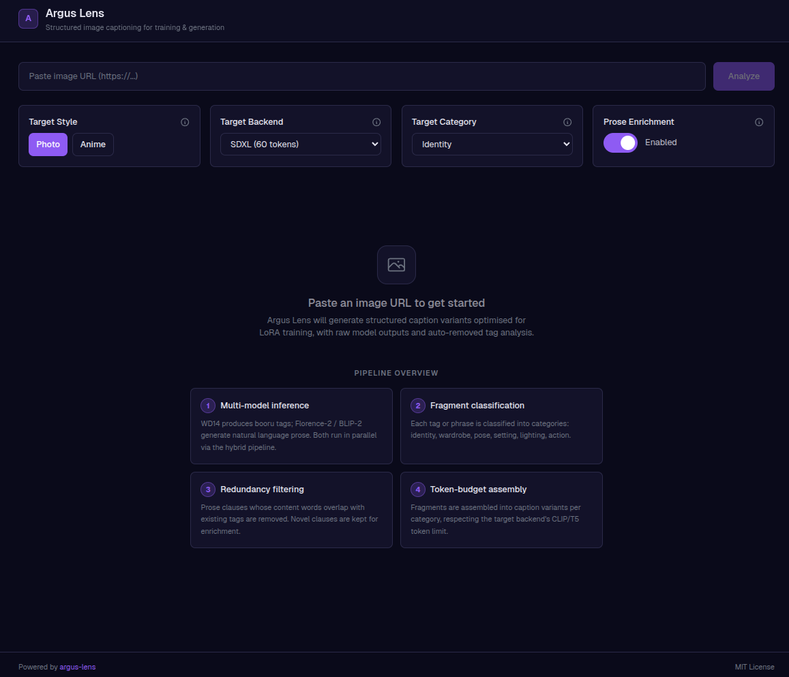
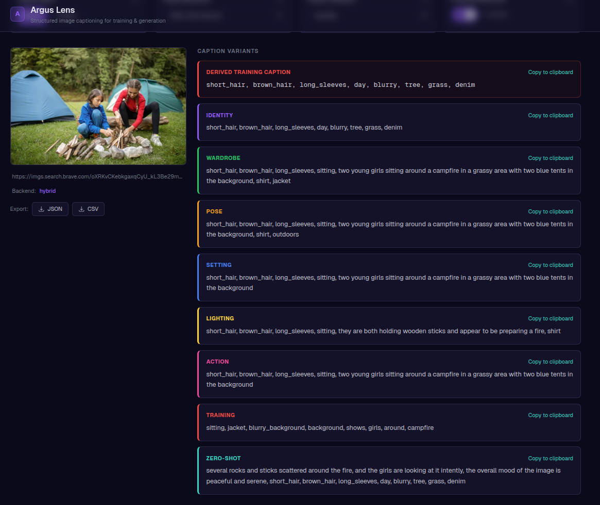
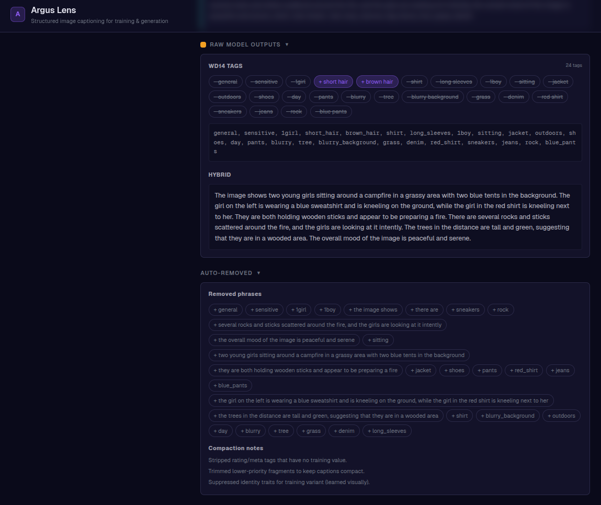

# Argus Vision Demo

Single-page web UI demonstrating [argus-lens](https://github.com/smk762/argus-lens) structured image captioning. Paste an image URL, configure pipeline parameters, and inspect training-optimised caption variants, raw model outputs, and auto-removed tag analysis. A separate **curator** view at [`/curate`](http://localhost:3000/curate) talks to [argus-curator](https://github.com/smk762/argus-curator) for folder scans and exports.

Designed as a living onboarding document -- every parameter includes an inline explanation of what it does and why.







## Quick Start

Start the `argus-lens` server first (in a separate terminal):

```bash
# In the argus-lens repo (PyPI install)
pip install argus-lens[server,local]
argus-lens serve --cors --port 8100
```

If you are developing **argus-lens locally**, rebuild the wheel and reinstall into the same environment you use for `serve` (the demo always talks to whatever is running on `NEXT_PUBLIC_API_URL`). Targets use [uv](https://docs.astral.sh/uv/) so installs work on PEP 668 (externally managed) system Pythons:

```bash
cd ../argus-lens
uv venv                 # once: create .venv in the repo
source .venv/bin/activate
make wheel-reinstall    # uv build + uv pip install --force-reinstall dist/*.whl[server,local,...]
argus-lens serve --cors --port 8100
```

Or use an editable install while hacking Python: `uv pip install -e ".[server,local]"` from the argus-lens repo (no wheel step).

### Curator SPA (`/curate`)

The curator UI calls `NEXT_PUBLIC_CURATOR_URL` (default `http://localhost:8101`). Run the FastAPI app from [argus-curator](https://github.com/smk762/argus-curator) in another terminal.

PyPI install:

```bash
pip install "argus-curator[server,gpu]"
argus-curator serve --cors --port 8101
```

**Local wheel** (after `uv build` or `hatch build` in the argus-curator repo — you should see something like `dist/argus_curator-0.1.1.dev2+g…-py3-none-any.whl`):

```bash
cd ../argus-curator
source .venv/bin/activate    # or: uv venv && source .venv/bin/activate
uv build
WHEEL="$(ls -t dist/*.whl | head -1)"
uv pip install --force-reinstall "${WHEEL}[server,gpu]"
argus-curator serve --cors --port 8101
```

Use `"${WHEEL}[server]"` instead of `[server,gpu]` if you only need the HTTP API without optional GPU detectors and embeddings. Editable alternative: `uv pip install -e ".[server,gpu]"` from the argus-curator repo.

From **this** repo root (activate the same Python venv you use for `argus-curator serve`), reinstall the newest wheel without `cd` by pointing at the sibling `dist/` (build in argus-curator first so `dist/*.whl` exists):

```bash
WHEEL="$(ls -t ../argus-curator/dist/*.whl | head -1)"
uv pip install --force-reinstall "${WHEEL}[server,gpu]"
```

Then launch the demo frontend:

```bash
# Docker (recommended)
cp .env.example .env
docker compose up --build
```

```bash
# Or local dev
cd frontend
npm install
npm run dev
```

Open [http://localhost:3000](http://localhost:3000) (captioning) or [http://localhost:3000/curate](http://localhost:3000/curate) (curation).

## Architecture

```
browser (:3000)  →  Next.js frontend
                         ├─ POST /caption/url  →  argus-lens (:8100)  →  captioning
                         └─ /scan/folder, …     →  argus-curator (:8101)  →  curation API
```

The demo is a thin frontend-only wrapper. It sends JSON requests to the `argus-lens` and `argus-curator` HTTP servers and renders results. No backend code lives in this repo.

- **Frontend** — Next.js 15 (App Router) + Tailwind CSS v4, dark theme
- **Captioning server** — `argus-lens[server]` (see [argus-lens](https://github.com/smk762/argus-lens))
- **Curation server** — `argus-curator[server]` (optional `gpu` extra; see [argus-curator](https://github.com/smk762/argus-curator))

## Configuration

| Variable | Default | Description |
|---|---|---|
| `NEXT_PUBLIC_API_URL` | `http://localhost:8100` | URL the browser uses to reach the argus-lens API |
| `NEXT_PUBLIC_CURATOR_URL` | `http://localhost:8101` | URL the browser uses to reach the argus-curator API (`/curate`) |
| `FRONTEND_PORT` | `3000` | Host port for the Next.js frontend (Docker only) |

`NEXT_PUBLIC_*` values are inlined when the client bundle is built. After changing the API URL in `.env`, restart `npm run dev` (local) or run `docker compose build --no-cache` before `docker compose up` so the container image picks up the new URL.

## Parameters

All captioning parameters are exposed in the UI with inline documentation:

| Parameter | Default | Description |
|---|---|---|
| `target_style` | `photo` | `photo` for realism models, `anime` for booru-tagged models |
| `target_backend` | `sdxl` | Diffusion backend — determines CLIP/T5 token budget (60–200 tokens) |
| `target_category` | `identity` | Which category variant becomes `final_caption` |
| `prose_enrichment` | `true` | Append novel prose-derived tokens to training variant at lowest priority |

## Related

- [argus-lens](https://github.com/smk762/argus-lens) — captioning engine, CLI, and server for the main demo page
- [argus-curator](https://github.com/smk762/argus-curator) — dataset curation CLI and HTTP server for `/curate`

## License

MIT
